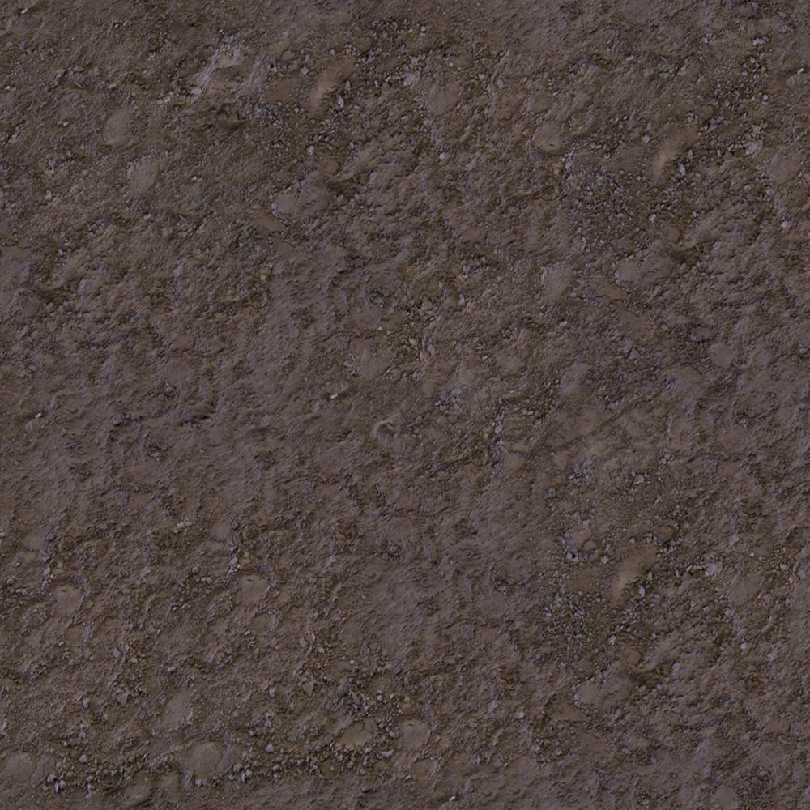

# <p align="center">  </p>
Writing advanced 3D or 2D applications can be an exciting challenge, but it often becomes complex when dealing with the details of porting or ensuring the application works seamlessly on the web. To address these challenges, I developed my own 3D graphics engine, Schnellwerke, designed specifically for the web.  
The core idea behind Schnellwerke is to maximize performance by leveraging WebAssembly and WebGPU technologies while optimizing the engine’s internal architecture for efficiency. It takes into account various crucial details to ensure high performance and smooth functionality across platforms.  
⚠️ The engine requires WebGPU and WebAssembly support to function!  

# <p align="center"> Internal structure </p>  
Since the first versions, I’ve made several changes to the internal structure. The engine now operates using two asynchronous loops: one managed by requestAnimationFrame and the other by a timer. This approach achieves two key goals:  
1. It decouples app logic and physics from the renderer, ensuring independence between them.  
2. Theoretically, it allows the browser to run these two tasks on different threads.  

Additionally, the entire rendering process is handled in JavaScript, which is faster since it avoids Rust-to-JavaScript calls. This is important because rendering cannot be done directly from Rust.  
  
# <p align="center"> Render </p>  
Since its initial versions, the renderer has undergone several changes. Firstly, it now supports multiple cameras and shadow maps, made possible by layered framebuffers. The only limits to the number of light sources in a scene are your imagination and available memory.  
The rendering method has also evolved, transitioning from the older forward rendering approach to a modern deferred renderer. This switch enables the use of significantly more lights and improves overall performance. As a result, the engine can achieve relatively good performance even on older hardware, such as Haswell iGPUs.  
Additionally, you can adjust the render resolution, shadow map resolution, and the number of cameras and shadow maps in real time. The engine automatically manages the generation of uniform buffers, processes them across all cameras, and handles other tasks seamlessly. 
<p align="center">  </p>  
<p align="center">  </p>  

# <p align="center"> Lighting </p>  

Since the first versions of the engine, alongside the use of deferred rendering instead of forward rendering, another new feature introduced is PBR (Physically Based Rendering), which is currently used for lighting. It is predefined in the shader code, and you only need to call it within the shader to utilize it.  

```rust  
let mut matgen = MaterialGenerator::new(vec![]);  
matgen.gen_post_vertex();  
matgen.gen_fragpost_beg();  
matgen.fragment_shader += "  
let albedo = pow(textureSample(mainMap, mySampler, in.uv, 0).rgb, vec3f(2.2));  
let WorldPos = textureSample(positionMap, mySampler, in.uv, 0).rgb;  
let norm = textureSample(normalMap, mySampler, in.uv, 0).rgb;  
let mat = textureSample(matMap, mySampler, in.uv, 0).rgb;  
  
let shadow = shcalc(WorldPos, 0.0);  
let metallic = mat.g;  
let roughness = mat.r;   
let ao = mat.b;  
  
let color = PBR(norm, albedo, shadow, metallic, roughness, ao, WorldPos);  
  
return vec4f(color, 1.0);";  
matgen.gen_frag_end();  
```

It automatically handles many tasks, such as shadow mapping and others.

Light sources may or may not cast shadows, and the two main types of light sources are directional lights and spotlights.

```rust
pub enum LightType{
    Directional,
    Spot,
}

pub struct Light{
    pub light_type: LightType,
    pub pos: Vec3,
    pub rot: Vec3,
    pub color: Vec3,
    pub shadow: bool,
}
```

# <p align="center"> Objects and scenes </p>  

Objects are actually created from two other structures: a renderable mesh and a physics object. Additionally, they include a UBO, which is managed automatically. Most of the properties, such as position and rotation, are controlled through the physics object field.

```rust
new(eng: &mut Engine, vertex_data: Vec<f32>, material: &Material, usage: MUsages, is_static: bool) -> Object
```

Vertex data can be loaded, and materials are generated using the material generator structure. The usage specifies whether the object is used for rendering in both the shadow and color passes or only in one of them.

```rust
pub struct Objreader{
    pub arr: Vec<f32>,
}
...
pub fn new(id: &str) -> Objreader
```

Here is the structure for reading an object file, or more accurately, parsing it. The files are opened in the browser through an iframe element, so the ID corresponds to an iframe element with the loaded file. The same approach applies to the rest of the files, except for images, which should be loaded using an  element.  
Some basic shapes are also predefined, namely a cube and a plane.  
A better approach, rather than creating and handling all these objects manually, is to create a scene. Scenes provide a more efficient way to manage various elements. Firstly, they can be loaded from a file. Secondly, they also manage interactions between objects, allowing one object to fall on top of another or enabling other types of interactions. Additionally, scenes handle lighting and audio management.  

```rust
pub enum ObjectType{
    Model,
    Cube,
    CubeUV,
    Plane,
}
pub struct ObjectCreateInfo{
    pub md: String,
    pub mat: Material,
    pub usage: MUsages,
    pub object_type: ObjectType,
    pub is_static: bool,
    pub pos: Vec3,
    pub rot: Vec3,
    pub scale: Vec3,
}
pub struct Scene{
    pub material_gen: MaterialGenerator,
    pub objects_to_create: Vec<ObjectCreateInfo>,
    pub all_objects: Vec<Object>,
    pub all_speakers: Vec<Speaker>,
}
```

So this is structure for scene, and other structures related to it.

Here’s how to create a scene: First, the scene is created, with no additional uniform buffer values specified. The second function loads a Scene Description File (SDF), which represents all the objects, lights, and speakers in the scene, taking some of their parameters into account. The third function creates all objects based on those loaded from the SDF, along with any user-defined objects.  

```rust
let mut scn = Scene::new(vec![]);
scn.load_objects(&mut eng, "charliesdf");
scn.create_objects(&mut eng);
```

And the SDF file itself:

```
md 1 1 0 0 0 0 0 0 1 1 1
//model is_static model_id positionX positionY positionZ RotationX Y Z ScaleX Y Z 
mat 1 2 0 1 4 1 2 3 4
//material normal_culling_mode shadow_culling_mode vertex_shader_id(0 for standart) fragment_shader number_of_textures tex0 tex1 tex2 texn 
cs 1 0 2 0 0 0 0 1 1 1
//cs is for cube, same as with model, but withouth model_id
mat 1 2 0 2 1 37
cu 1 3 1 0 0 0 0 1 1 1
//cu is for cube with all faces having same uv, same as with model, but withouth model_id
mat 1 2 0 2 1 38
pl 1 -2 2 0 1.57079633 0 0 1 1 1
//pl is for plane, same as with model, but withouth model_id
mat 1 2 0 2 1 39
lt 0 25.739145 5.14 -10.085049 -0.16399525 -2.5740542 0 10 10 9.9
//light type(0 for spot) PositionX Y Z RotationX Y Z ColorR G B
sp 1 50 0.25 1 0 0 0
//speaker audio_id power volume PositionX Y Z
```

I tried to describe all the commands currently available. The main purpose here is to outline the minimal properties required for each object to create a scene. The only remaining question might be how to handle different object IDs. All objects are loaded within an HTML file, and every element should have an ID. Additionally, since we know each object's type, this allows us to implement something like this:  

```html
<iframe src="assets/charlie/ground/model1.txt" type="text/plain" id="md1" style="display: none;"></iframe>

<audio src="assets/charlie/sample.mp3" id="spk1"></audio>
...
```

While loading a model, the parser will simply take the type (in our case, "md") and the model ID, which will be 1 in the first instance. As a result, we will get an ID like "md1." The same logic applies to audio, images, and everything else loaded from a file.  

# <p align="center"> Physics </p>  

It is quite simple but may be sufficient for many purposes. Since the first versions, new properties have been added alongside speed. One of these properties is acceleration, which describes changes in speed. Starting from now, processes like falling will be more realistic. The same applies to objects with physics within a scene, as the scene enables objects to calculate interactions between them.  
Another significant change is that many properties are now managed by the physics object, such as position—for example, the camera's position:  

```rust
eng.cameras[0].physic_object.rot.x += eng.mouse.get_y_coords() as f32/eng.render.get_canvas_size_y()as f32;
eng.cameras[0].physic_object.rot.y += eng.mouse.get_x_coords() as f32/eng.render.get_canvas_size_x()as f32;
...
if eng.keyboard.is_key_pressed(11){
  eng.cameras[0].physic_object.speed.z += f32::cos(eng.cameras[0].physic_object.rot.x) * f32::cos(eng.cameras[0].physic_object.rot.y) * SPEED;
  eng.cameras[0].physic_object.speed.x += f32::cos(eng.cameras[0].physic_object.rot.x) * f32::sin(eng.cameras[0].physic_object.rot.y) * -SPEED;
}
```

To make everything more logical, even the camera has a physics object, allowing it to collide with other objects.

To calculate physics, I am using the AABB algorithm because it is simple and fast. This time, I am avoiding my previous mistake of putting everything related to physics on the GPU. Instead, there are fewer calculations, and they are performed on the CPU.  

To get this algorithm working, you need two vectors: one indicating the smallest and lowest point, and the other indicating the highest and biggest point of the model. You can either define them manually or let the system calculate them automatically for objects.

```rust
PhysicsObject::new(vec![Vec3::newdefined(0.1, 0f32, 0.1), Vec3::newdefined(-0.1, -5f32, -0.1)], false)
...
PhysicsObject::new(getpoints(v.to_vec()), is_static)
```

# <p align="center"> Camera </p>  

As previously mentioned, the engine supports multiple cameras. Furthermore, if a light source has shadows, it calculates a projection based on a camera. Cameras have various properties, which can be seen in the struct:  

```rust
pub struct Camera{
    pub physic_object: PhysicsObject,
    pub fov: f32,
    pub znear: f32,
    pub zfar: f32,
    pub is_orthographic: bool,
}
```

*If is_orthographic is true, then fov will act as a size modifier for the clip space.:

```rust
ubm.orthographic(self.fov, -self.fov, self.fov, -self.fov, self.znear, self.zfar);
```

still in writing :)...
