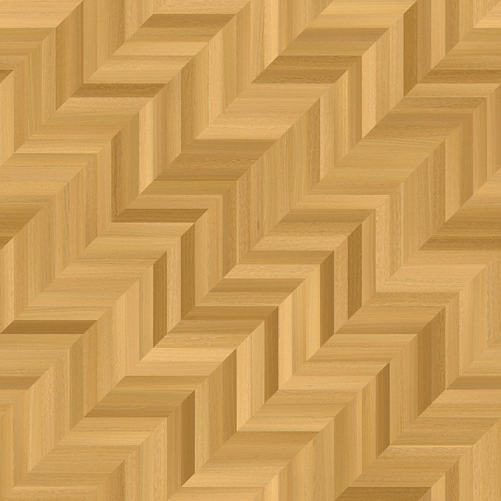
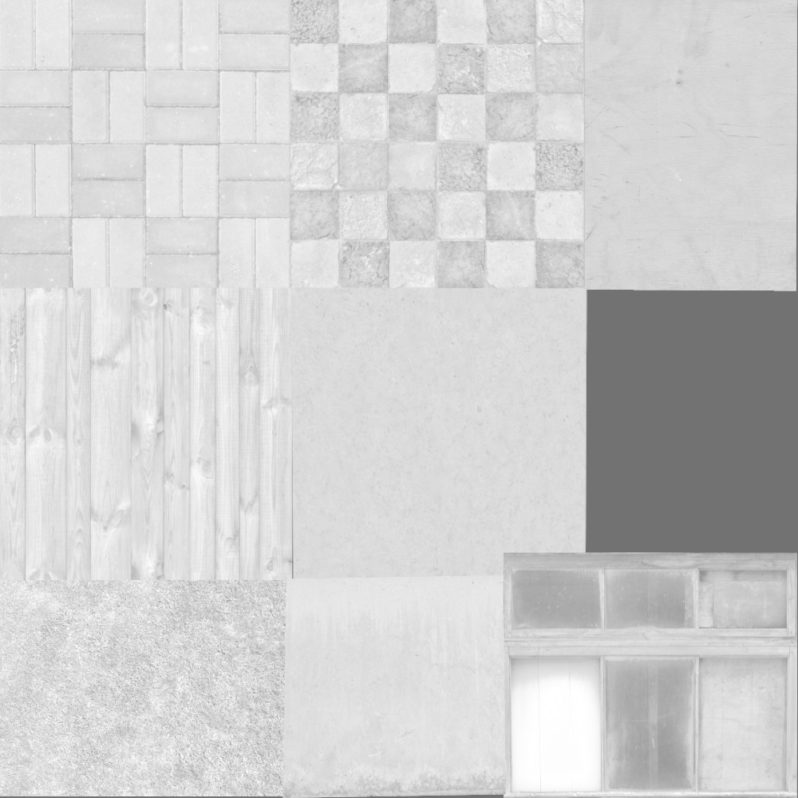
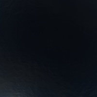
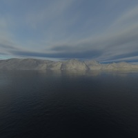
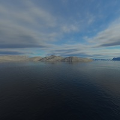

# <p align="center">  </p>
Writing games or other 3D apps is quite an interesting process, until you realize some aspects, like porting or bad performance. You can write a web game, but it might perform poorly. Alternatively, you can write a standalone game, but porting can be time-consuming. I decided to combine incompatible things. My game engine is designed to be completely programmable from Rust. Most of the engine components are written in Rust, which allows for much higher performance compared to alternatives in JavaScript/TypeScript. At the same time, it is an engine for the web, requiring nothing special to work on other platforms (currently more of a future prospect due to WebGPU API). It works on PC Chromium, tested on Windows and Linux, and works on Android with a specific flag enabled. Additionally, for many programmers, programming in Rust can be simply more comfortable. Currently, I am working on implementing:  
1. Shadow mapping (partially implemented).  
2. Advanced lighting: Physically Based Rendering (PBR).  
# <p align="center"> Creating objects </p>  
The first step is loading the model and its textures, which is handled by your browser. Essentially, you're loading them as HTML elements with the CSS property display:none set:  
```










<iframe src="assets/m.txt" type="text/plain" id="md1" style="display: none;"></iframe>
<iframe src="assets/cube.txt" type="text/plain" id="cube" style="display: none;"></iframe>
```
if you dont want to load your model, you can always define it in code:  
```
let vertices: [f32; 24] = [
        -1.0, -1.0, -0.5, 1.0,
        -1.0, 1.0, -0.5, 1.0,
        1.0, 1.0, -0.5, 1.0,

        -1.0, -1.0, -0.8, 1.0,
        1.0, 1.0, -0.8, 1.0,
        1.0, -1.0, -0.8, 1.0
];
let uv: [f32; 12] = [...];
let normals: [f32; 18] = [...];
```  
Additionally, you need to construct a uniform buffer where you will store all the data you want to use later in your shaders. This includes information such as light positions, various matrices, and other pertinent data. This can be structured like so:  
```
let mut uniforms: Vec<Uniformstruct> = vec![];
uniforms.push(createmvpmat());
uniforms.push(createsmvpmat());
uniforms.push(createvec4(Vec4::new()));
uniforms.push(createvec4(Vec4::new()));
uniforms.push(createvec4(Vec4::new()));
```  
and use all this to create object:  
```
let mut mesh: Object = Object::new_from_obj(&eng, "md1", vertc, vertsc, fragc, &uniforms, "tex;spec;norm", "", "linear", "linear", false);
let mut skybox: Object = Object::new_from_obj(&eng, "cube", vertsk, vertsc, fragsk, &uniforms, "", "right;left;top;bottom;front;back", "linear", "linear", false);
let mut renquad: Object = Object::new(&eng, &vertices, &uv, &normals, 6, pvertc, vertsc, pfragc, &uniforms, "", "", "nearest", "nearest", true);
```  
To create an object, you need the following components:  
1. An engine handle  
2. An ID for your model or vertices/UV/normals, along with the number of vertices  
3. Vertex code  
4. Vertex code for shadow mapping  
5. Fragment code  
6. A reference to a uniform buffer created earlier  
7. IDs of images, delimited with a semicolon  
8. IDs for cubemap faces, also delimited with a semicolon  
If no image is passed or there aren't enough faces, the engine will automatically generate a texture  
9. Specifications for min and mag filters  
10. If "forpost" is true, the mesh will be prepared to be rendered in the final pass, typically used for UI elements or post proccesing.  
  
this model parsing takes less than a second, its size is 12 mb, i tried a 60 mb file, it is parsing in about 3 seconds, most of time is being spended on browser to load resource. by the way, before loading any data make sure you page with resources is completly loaded:
```
import init, { main } from "./pkg/schnellwerke.js";
      window.addEventListener("load", function (event) {
        init().then(() => {
          main();
        });
      });
```
by the way, here is demo of its working on mobile:  

# <p align="center"> Physics </p>   
Firstly, each object has the following flags:  
1. collision_detect: If set to true, collision detection will be calculated.
2. camera_collision_interact: If set to true, the camera will be prevented from falling inside the object and from passing through it.
3. is_interacting: This is intended to be read-only. A value of 0 indicates no interaction at all, 1 means the camera is on the object, and 2 means it is inside the object.  
Both the camera and object have a speed property which modifies their positions.  
Currently, only interactions between the camera and objects are available.  
Several important considerations:  
1. All collision detection is calculated on the GPU using compute shaders.
2. It calculates collisions per triangle, meaning you can go inside an object without interaction if there are no triangles inside. This system was primarily designed to allow for complex concave/convex models while still providing collision detection.
# <p align="center"> Audio </p>   
Audio engine is based on Audio class in js which is based on html5 audio, nothing special here, except volume, which is influenced by distance of audio source to player, audio source is created like this:
```
let mut as1 = Audiosource3d::new("assets/sample.mp3", Vec3::newdefined(0f32, -4f32, 0f32), 10f32);
```
first is url, second is position, third is power, or max distance in which you still can hear something  
